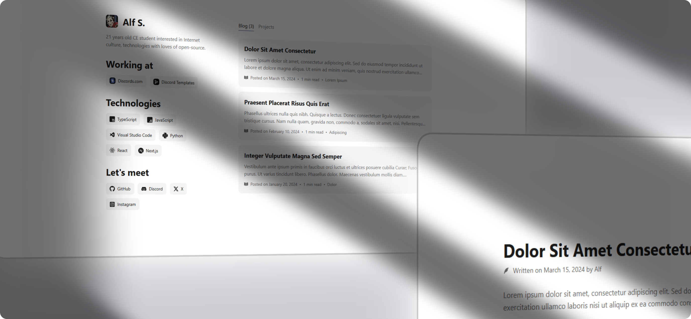
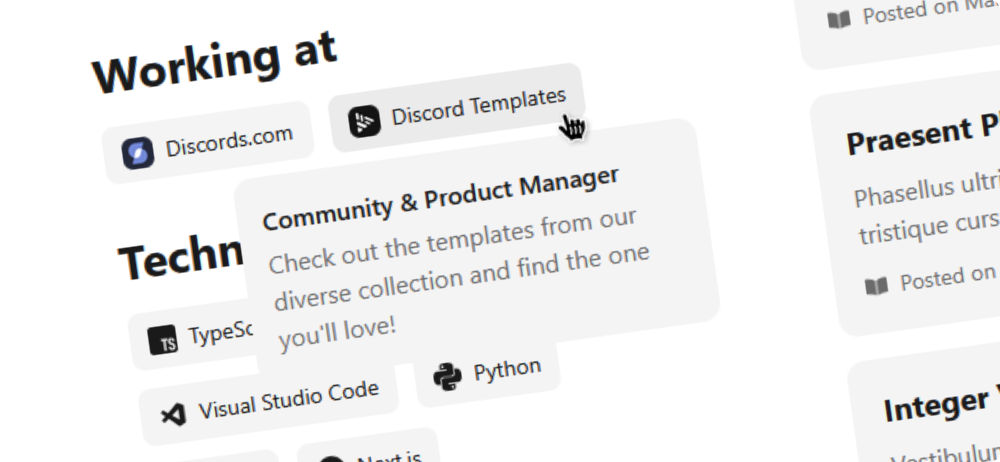

# Old Portfolio

A minimal, light-themed personal portfolio and blog built with **Gatsby v5**, **React 18**, and **Chakra UI v2**.

## Tech Stack

- **Framework:** [Gatsby](https://www.gatsbyjs.com/) v5
- **Library:** [React](https://react.dev/) 18
- **Components:** [Chakra UI](https://chakra-ui.com/) v2
- **Animation:** Emotion, Framer Motion
- **Icons:** [React Icons](https://react-icons.github.io/react-icons/)

## Structure

```text
├── .github/
│   └── assets/        # Media for README
├── content/
│   └── posts/         # Markdown
│       └── 1/
│           └── index.md
├── src/
│   ├── components/    # Components
│   ├── pages/         # Gatsby page routes (index, 404)
│   ├── style/         # Styles
│   ├── templates/     # Dynamic blog post
│   └── theme/         # Chakra UI theme
└── static/            # Static (images, logos, favicon)
```



### Installation

```bash
# Clone the repository
git clone https://github.com/alfredsaveron/old-portfolio.git

# Navigate into project directory
cd old-portfolio

# Install dependencies
npm install --legacy-peer-deps
```

### Development

```bash
npm start
# or
npm run develop
```

Open `http://localhost:8000` in your browser.

### Build

```bash
npm run build
```

Production output will be generated inside the `public/` directory.
